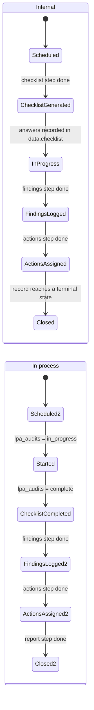
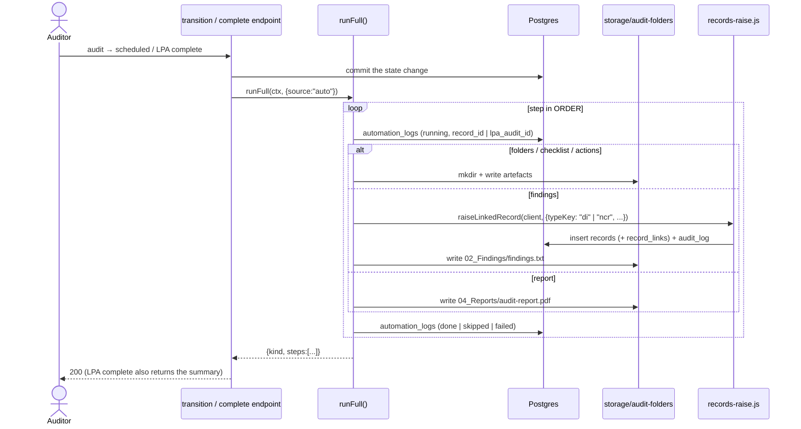
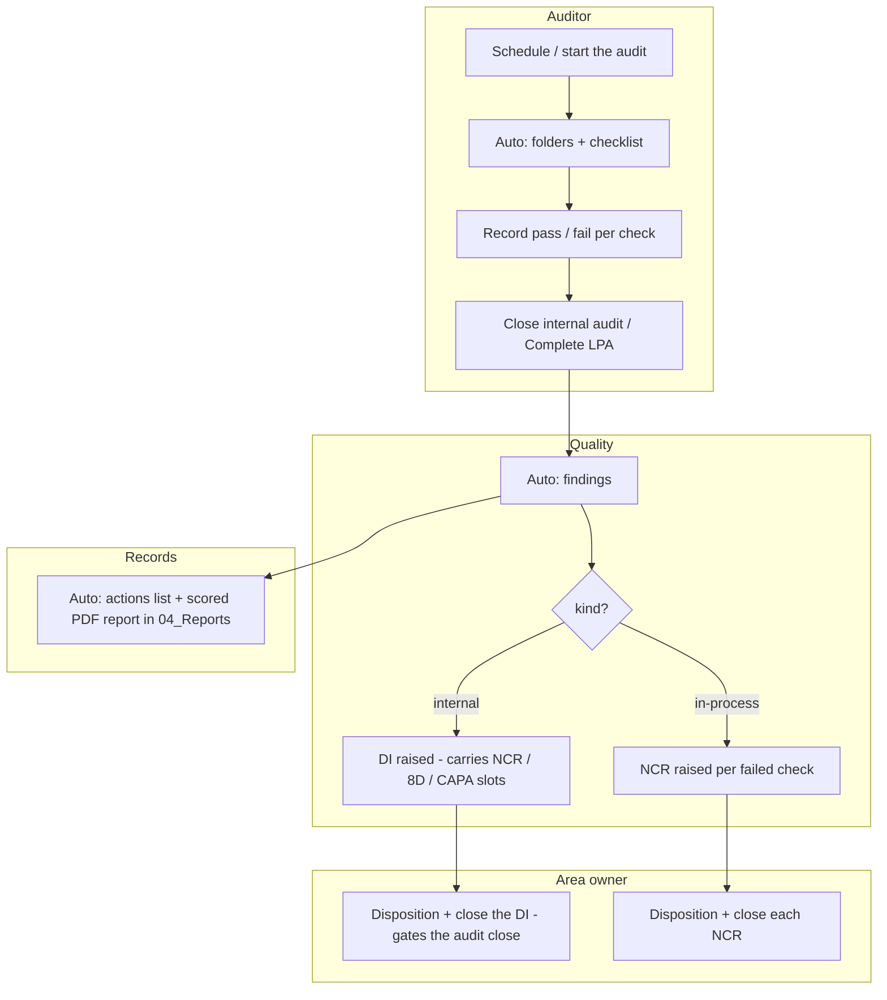

# Internal + In-Process audit automation

One engine (`server/src/audit-automation.js`) drives both audit kinds
through the same five steps, on top of what the app already has — the
`audit` record type, the LPA module, the `di.js` audit→DI bridge, the
`records-raise.js` helper, and the `automation_logs` trail.

| | Internal audit | In-process audit |
|---|---|---|
| Subject | a `records` row of type `audit` (clause 9.2) | an `lpa_audits` row (clause 9.2.2) |
| Checklist source | an `lpa_templates` template, id in `records.data.checklist_template_id` | `lpa_audits.template_id` |
| Answers | `records.data.checklist` `[{question_id, text, result, note}]` | `lpa_answers` |
| Finding raises | one **Discrepancy Investigation**, `child_of` the audit | one **NCR** per failed check, number written to `lpa_answers.ncr_number` |
| Auto-fires | on the workflow transition to `scheduled` (folders + checklist) and to a terminal state (findings + actions + report) | on `POST /api/lpa/audits/:id/complete` (all five steps) |
| Addressed by | record number (`AUD-YYYY-NNNN`) | `lpa_audits` id |

The folder tree is real directories under
`server/storage/audit-folders/<root>/` when `STORAGE_DRIVER=local`
(`root` is the audit's **id**, not its number — audit numbers restart
per org): `01_Checklists`, `02_Findings`, `03_Actions`, `04_Reports`.

---

## The steps

| Step | What it does | Idempotency |
|------|--------------|-------------|
| `folders` | `mkdir` the four-folder tree; store `folder_root` on `records.data.automation` / `lpa_audits.folder_root` | `mkdir -p`; upsert |
| `checklist` | Load the template's questions; write `01_Checklists/checklist.json` + a branded blank `checklist.pdf` | skip if `checklist.pdf` exists (unless `force`) |
| `findings` | Scan answers for `fail`. Internal → raise one DI (all fails in `data.finding`) unless one is already linked. In-process → raise one NCR per failed answer that has no `ncr_number` yet, write the number back. Write `02_Findings/findings.txt` | internal: skip if a DI is linked. in-process: skip answers that already carry an NCR |
| `actions` | Write `03_Actions/actions.txt` — the DI's NCR/8D/CAPA form slots (internal) or the raised NCRs (in-process) as open actions | pure file write |
| `report` | Score `= pass / (pass + fail)`; branded PDF to `04_Reports/audit-report.pdf` | regenerated every run |

`ORDER = ["folders", "checklist", "findings", "actions", "report"]`.

---

## Derived phase — the workflows are not changed

The 6-phase lifecycle the UI shows is **computed** (`computePhase()`)
from step completion + the record's native status. The `audit` record
type (`draft → scheduled → overdue → closed`) and `lpa_audits`
(`scheduled → in_progress → complete → missed`) keep their own
workflows, so the `di.js` "an audit cannot close until its DI is
closed" gate is untouched.

Per step, the `automation_logs` state is
`pending → running → done | skipped | failed`; `failed → running` on a
retry, `done → running` on a re-run (`?force` for the ones that guard
on "already there").

---

## Sequence

Every step is also a manual button — `POST /api/audits/:number/automation/run`
or `/:step` (perm `audit.schedule`), `POST /api/lpa/audits/:id/automation/run`
or `/:step` (perm `lpa.audit`). `GET .../automation` returns
`{ kind, phase, folder_root, score, steps }`; `GET .../automation/logs`
returns the append-only history. Reads need `audit.read` / `lpa.read`.

---

## Swim-lane — who owns what

---

## Best practices this module follows

**Idempotency.**
- `folders` — `mkdir -p` and an upsert of `folder_root`.
- `checklist` — a per-file existence check; `?force` re-writes.
- `findings` — internal keys on "does this audit already have a
  `child_of` DI"; in-process skips any answer that already carries an
  `ncr_number`. A re-run never raises a second downstream record.
- `report` — deliberately regenerated each run (cheap, always correct).

**Logging.**
- One `automation_logs` row per attempt, `run_source` `auto` | `manual`,
  keyed by `record_id` **or** `lpa_audit_id` (the `054` table gained
  those columns in `055`; a check keeps exactly one subject set).
- The status panel shows the latest row per step; audits read the whole
  history from `.../automation/logs`.

**Error handling.**
- `runStep` never throws — a failure is `{ status: "failed", error }`
  and a logged row.
- `runFull` catches per step and continues.
- The transition hook (`onAuditTransition`) and the LPA-complete hook
  both swallow: a failed automation never undoes the state change, and
  the endpoint still returns 200.

**No duplication.** No new audit tables, no new checklist engine, no new
NCR-creation path, no new permission. The one extraction —
`records-raise.js` — replaced three hand-rolled copies (`di.js`,
`operations.js`, and this engine) and fixed their shared latent
number-sort bug (`order by number desc` put `X-10` before `X-9`).

See also `docs/audit-di-workflow.md` for the audit → DI → NCR / 8D /
CAPA closure gates.
