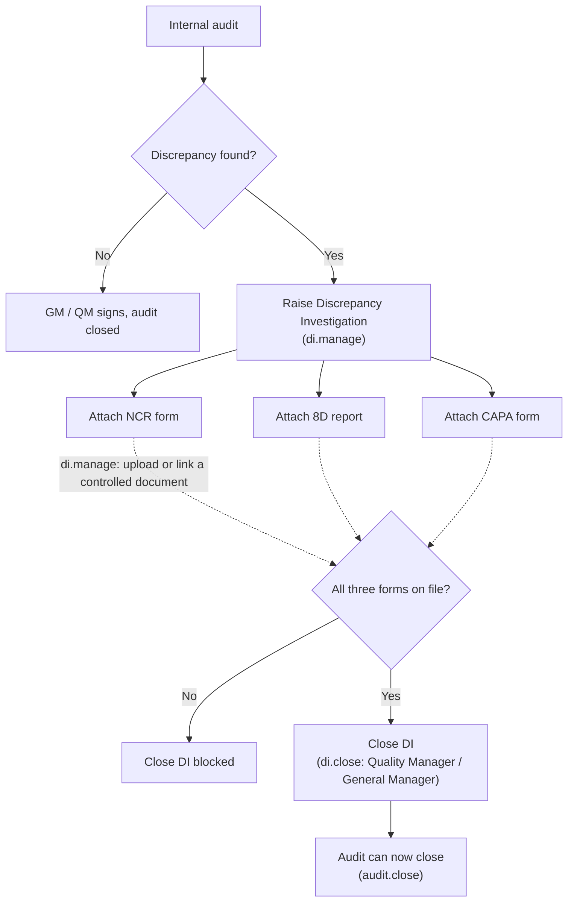
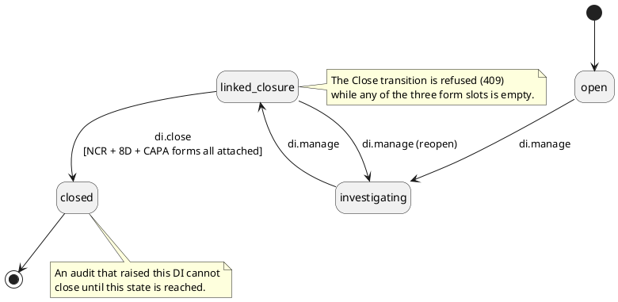

# Audit &rarr; Discrepancy Investigation &rarr; NCR / 8D / CAPA

How an internal audit finding (ISO 9001 clause 9.2) becomes a Discrepancy
Investigation and its corrective forms (8.7 / 10.2), and the two gates that hold
each closure until its downstream work is done.

The app renders these two figures as inline SVG on the **Quality &rarr; Audit &rarr;
CAPA Workflow** page (`public/js/views/workflow-help.js`). This file is the
regenerable source: the same two figures as Mermaid and PlantUML.

---

## What it is

- A **Discrepancy Investigation (DI)** is a record type (`di`) on the same
  records engine as NCR / CAPA / 8D / audit. Migration `026_discrepancy_investigation.sql`.
- It is raised **from an audit** that turned up a discrepancy. The link is a
  `record_links` row, `link_type = 'child_of'`, audit &rarr; DI. One DI per audit.
- It carries the three completed forms the finding needs &mdash; the **NCR form**,
  the **8D report**, the **CAPA form** &mdash; each a controlled document in a
  named slot (`di_deliverables`). A slot is filled by uploading the completed
  form (it becomes a controlled document linked to the DI) or by linking one
  already in Document Control.
- The DI's own workflow: `open &rarr; investigating &rarr; linked_closure &rarr;
  closed`, plus a `linked_closure &rarr; investigating` reopen edge.

## The two gates (enforced in `POST /api/records/:number/transition`)

1. **DI closure** &mdash; a DI cannot enter `closed` until all three form slots
   are filled. The 409 response, and the disabled Close button, both list the
   missing forms.
2. **Audit closure** &mdash; an audit that raised a DI cannot enter `closed`
   until that DI is `closed`.

## Permissions

| Action | Permission | Roles (as provisioned) |
|---|---|---|
| Read a DI | `di.read` | Quality Inspector, Quality Tech, Quality/Manufacturing Engineer, Engineering Manager, Quality Manager, GM, Admin |
| Raise a DI, run the investigation, attach / replace / remove a form | `di.manage` | Quality Engineer, Manufacturing Engineer, Engineering Manager, Quality Manager, GM |
| Close a DI | `di.close` | **Quality Manager and General Manager only** |

`audit.close` closes the audit; `di.manage` covers every DI edit; field edits on
the DI record itself (root cause, containment) need no extra authority but are
audit-logged like every other record.

---

## Figure 1 &mdash; the flow (Mermaid)

## Figure 2 &mdash; the DI state machine (PlantUML)

---

## Regenerating

- **Mermaid**: paste the fenced block into <https://mermaid.live> or any Mermaid
  renderer.
- **PlantUML**: paste into <https://www.plantuml.com/plantuml> or run a local
  `plantuml` jar.

The in-app SVG in `workflow-help.js` is drawn by hand to match the rest of the
app's visuals (the turtle diagram, the review charts) and carries no diagram
runtime. Keep the three artefacts &mdash; this file's two blocks and the SVG
&mdash; in step when the workflow changes.
