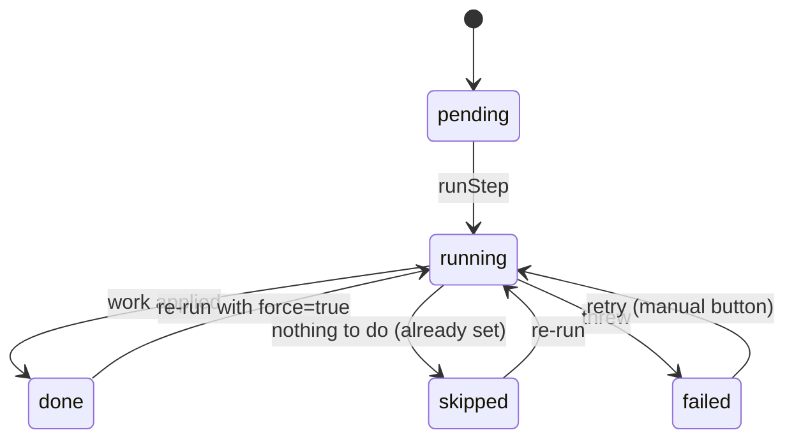
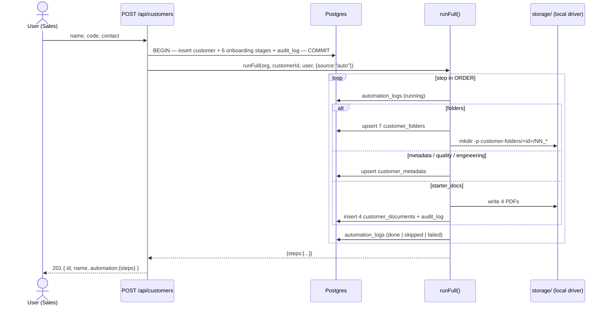
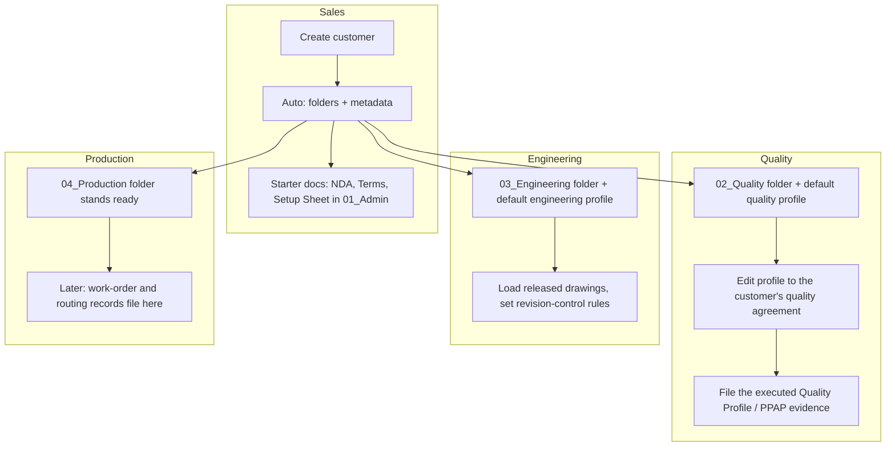

# Customer onboarding automation

How a new customer becomes a fully set-up account: seven numbered
folders, a metadata snapshot, a default quality profile, a default
engineering profile, and four branded starter PDFs — built by an engine
that runs automatically on creation and is also a set of manual buttons
on the customer's folder page.

- Engine: `server/src/customer-automation.js`
- Routes: `server/src/routes/customers.js`
- Schema: `server/db/migrations/054_customer_automation.sql`
  (`customer_folders`, `customer_metadata`, `automation_logs`;
  `customer_documents.folder_id`)
- UI: `public/js/views/customers.js` (Automation panel + folder panels)

---

## The steps

| Step | Function | What it does | Idempotency |
|------|----------|--------------|-------------|
| `folders` | `seedFolders` | Upserts the seven `customer_folders` rows (`01_Admin` … `07_Projects`); when `STORAGE_DRIVER=local`, `mkdir -p` each under `storage/customer-folders/<customerId>/`. Sets `status='created'`. | `on conflict (customer_id, folder_key) do update` |
| `metadata` | `syncMetadata` | Upserts the 1:1 `customer_metadata` row from the `customers` record: billing/shipping address, a `Primary` contact entry, `folder_root`, `synced_at`. | Upsert; never overwrites a contact list a user has since edited |
| `quality` | `seedQualityProfile` | Writes a default `quality_requirements` JSON (inspection, certifications, packaging & labeling). | Only when the column is empty — unless `force` |
| `engineering` | `seedEngProfile` | Writes a default `engineering_requirements` JSON (drawings, revision control, material specs). | Only when the column is empty — unless `force` |
| `starter_docs` | `generateStarterDocs` | Builds four one-page branded PDFs — **NDA**, **Terms & Conditions**, **Customer Setup Sheet** into `01_Admin`; **Customer Quality Profile** into `02_Quality` — via `drawLetterhead`/`drawFooter`, saves each with `saveUploadedFile`, inserts a `customer_documents` (`kind='upload'`) row + an `audit_log` line. | Per-file: skip any whose `original_filename` already sits in the target folder |

`ORDER = ["folders", "metadata", "quality", "engineering", "starter_docs"]`.

---

## State machine (per step)

Every transition into `running` writes a new `automation_logs` row
(`status='running'`, `run_source` `auto` | `manual`, `started_at`), and
the terminal state updates that same row (`detail` on success/skip,
`error` on failure, `finished_at`). The table is **append-only** — one
row per attempt — so the panel shows the latest per step and the full
history is `GET /api/customers/:id/automation-logs`.

---

## Sequence — automatic run on create

**Continue-on-failure.** `runFull` catches per step and moves on. A
failed step is logged `failed` with its message; the customer is still
created and `POST /api/customers` still returns **201**. The user
re-runs the failed step from its button. The `runFull` call in the
route is itself wrapped in `try/catch` — a catastrophic engine error
logs and the response is still 201 with `automation: null`.

---

## Swim-lane — who owns what

`05_SupplyChain`, `06_Orders`, `07_Projects` are created empty for
purchasing, order acknowledgements/quotes, and per-programme project
files respectively.

---

## Manual endpoints

All require `customer.manage` (the logs endpoint requires `customer.read`).
Each resolves the customer inside the caller's org first → **404**
cross-tenant.

| Method | Path | Runs |
|--------|------|------|
| `POST` | `/api/customers/:id/run-full-automation` | `runFull` (`source:"manual"`); body/query `force` also rewrites the two profiles |
| `POST` | `/api/customers/:id/create-folders` | `folders` |
| `POST` | `/api/customers/:id/sync-metadata` | `metadata` + `quality` + `engineering` |
| `POST` | `/api/customers/:id/generate-starter-docs` | `starter_docs` |
| `GET`  | `/api/customers/:id/automation-logs` | the last 200 `automation_logs` rows, newest first |

`GET /api/customers/:id` gained `folders` (the seven, each with its
`documents`), `metadata`, and `automation` (`{ steps: [...], last_run }`,
one entry per step, `pending` if never run). The old `library` block
(six free-form categories) is gone; `POST /api/customers/:id/documents`
now takes `folder_key` where it used to take `category`.

---

## Best practices this module follows

**Idempotency — every step is safe to run again.**
- `folders`: `on conflict (customer_id, folder_key) do update` — a
  re-run refreshes `path`/`status`, never a duplicate row. `fs.mkdir`
  with `{ recursive: true }` is a no-op when the directory exists.
- `metadata`: a single upsert; the `contacts` array is only seeded when
  still `[]`, so a re-run never clobbers a list a user has edited.
- `quality` / `engineering`: written only when the column is `{}` — a
  re-run reports `skipped`. The `force` flag is the deliberate override
  (the "reset to default" button), and it is the *only* way `done → running`.
- `starter_docs`: a per-file existence check (`original_filename` in the
  target folder) — delete one PDF and re-run to get it back, run again
  and nothing happens.

**Logging — an append-only trail.**
- One `automation_logs` row per attempt, never updated in place beyond
  its own terminal state. `run_source` distinguishes the automatic run
  from a manual retry. A thrown error is captured (truncated to 500
  chars) in `error`, not swallowed.
- The status panel reads the latest row per step; audits read the whole
  history.

**Error handling — the automation never breaks the customer.**
- `runStep` never throws: a step failure is a returned
  `{ status: "failed", error }`.
- `runFull` iterates and continues past a failure.
- The route's `runFull` call is wrapped again so even an engine-level
  fault leaves `POST /api/customers` returning 201.

**Storage — driver-aware.**
- Real directories are made only under the `local` driver. Under `s3`
  (contract-only in this build) the rows still carry the logical `path`;
  a future s3 driver uses `storage_path` as the object key prefix.

---

## Reusing the engine for NCR / CAPA / 8D automation

The `STEPS` registry + `runStep` / `runFull` shape is deliberately
generic. A future `server/src/ncr-automation.js` would:

1. Define its own `STEPS` map and `ORDER` (e.g. `notify_owner`,
   `open_containment_task`, `schedule_effectiveness_check`).
2. Reuse `runStep` / `runFull` — lift them into a shared
   `automation-runner.js` that takes a registry, or copy the ~30-line
   pattern.
3. Write to the same `automation_logs` table. It is currently keyed by
   `customer_id`; when record automation lands, add a nullable
   `record_id uuid references records(id) on delete cascade` and relax
   the `customer_id` not-null (a check that exactly one of the two is
   set, mirroring `customer_documents_target_one`).
4. Fire from the record-create path the same way — after the
   transaction commits, in a `try/catch` that never fails the create.

The invariants carry over unchanged: idempotent steps, one log row per
attempt, continue-on-failure, and the triggering write always succeeds.
